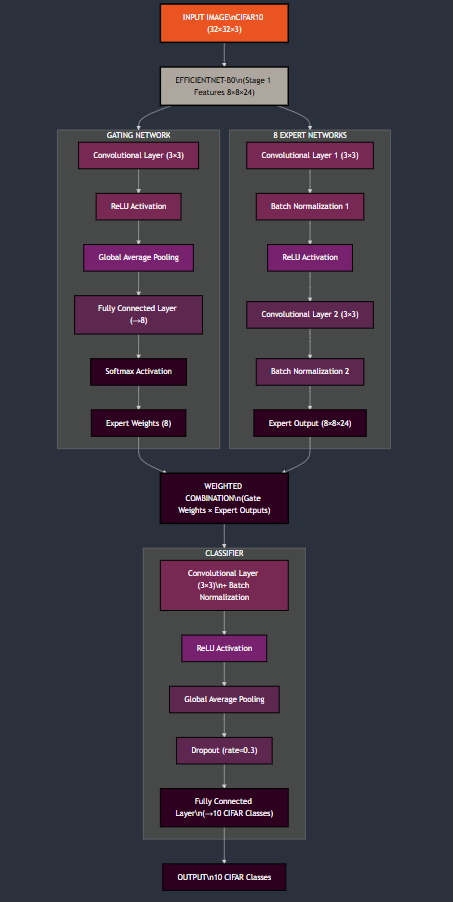

# timm-moe
## using pytorch pretrained image models to create Mixture of experts.
The purpose of this repo is to give an understanding how TIMM features can be used 
to train a mixutre of experts for classification. 

It is a single file repo, train/testing is done on CIFAR10 dataset. 
efficientnet_xx versions were used to perform the training and validation
which stand at close to 90% or 91% depending on which architecture is chosen

NOTE: Code will break if any other TIMM model is used. So better understand which layers
are necessary to extract features.

The MOE is based off 2D features. 



Output is a classification matrix and a expert usage distribution. Not perfect though 


The datasets are automatically downloaded and placed in a 'data' folder.


# Separate learning rates for different components
For each component of the Architecture we use a different learning rate. 
```
 params = [
        {'params': model.backbone.parameters(), 'lr': 1e-4},  # Lower LR for pretrained
        {'params': model.gate.parameters(), 'lr': 3e-4},      # Medium for gate
        {'params': model.experts.parameters(), 'lr': 3e-4},   # Medium for experts
        {'params': model.classifier.parameters(), 'lr': 3e-4} # Medium for classifier
    ]
```